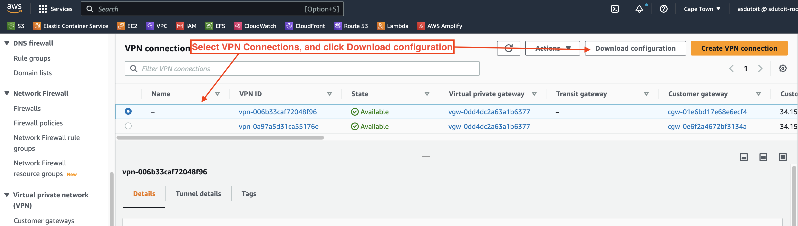
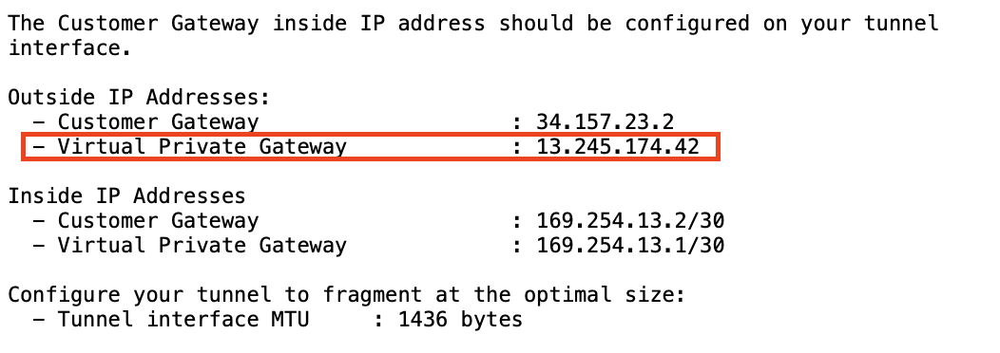
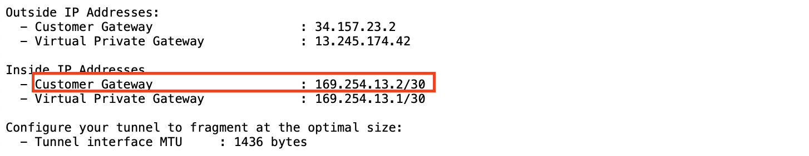
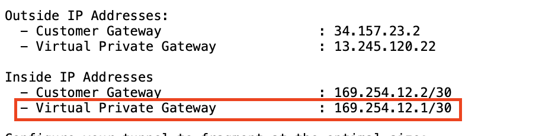
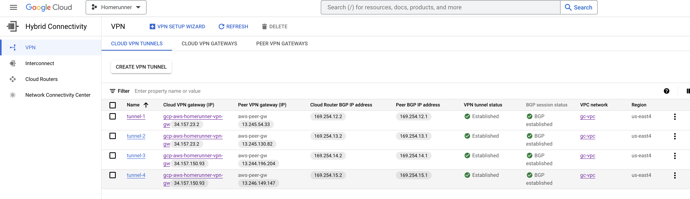

# Create a Highly Available VPN Connection between GCP and AWS

This repo includes a `.envrc` file.  
Complete this file with your GCLOUD and AWS account details to ensure the script runs correctly.

> NOTE: DO NOT EXECUTE THE SCRIPT IN IT'S ENTIRETY! There are arguments required that cannot be automatically returned / infered by any of the functions. The `inside` and `outside` ip addresses are only available from the AWS Configuration files which in turn can only be downloaded from the AWS Console after **Step 3** in this guide has been completed.

## 1. Create a custom VPC network with a single subnet:

<br />

### Create new VPC

```
gcloud compute networks create gc-vpc \
 --subnet-mode custom \
 --bgp-routing-mode global
```

### Create a single subnet to host the test VMs:

```
gcloud compute networks subnets create subnet-east4 \
 --network gc-vpc \
 --region us-east4 \
 --range 10.1.1.0/24
```

---

<br />

## 2. Create the HA VPN gateway and Cloud Router:

<br />

### Create VPN Gateway

```
gcloud compute vpn-gateways create gcp-aws-homerunner-vpn-gw \
 --network gc-vpc \
 --region us-east4
```

```
NAME: gcp-aws-homerunner-vpn-gw
INTERFACE0: 34.157.23.2
INTERFACE1: 34.157.150.93
```

### Create a Cloud Router:

```
gcloud compute routers create gcp-homerunner-cloudrouter \
--region us-east4 \
--network gc-vpc \
--asn 65534 \
--advertisement-mode custom \
--set-advertisement-groups all_subnets
```

<br />

---

<br />

## 3. Create Gateways and VPN connections on AWS:

<br />

### Create two customer gateways:

```
aws ec2 create-customer-gateway --type ipsec.1 --public-ip 34.157.23.2 --bgp-asn 65534

aws ec2 create-customer-gateway --type ipsec.1 --public-ip 34.157.150.93 --bgp-asn 65534
```

### Create Virtual Private Gateway:

```
aws ec2 create-vpn-gateway --type ipsec.1 --amazon-side-asn 64512
```

### Attach Virtual Private Gateway to VPC Network

```
aws ec2 attach-vpn-gateway --vpn-gateway-id vgw-07ad8ff9023f4e8ee --vpc-id vpc-059aef060320397c4
```

### Create 2x VPN connections with dynamic routing

```
aws ec2 create-vpn-connection \
--type ipsec.1 \
--customer-gateway-id cgw-0e6f2a4672bf3134a \
--vpn-gateway-id vgw-0dd4dc2a63a1b6377 \
--options TunnelOptions='[{TunnelInsideCidr=169.254.12.0/30,PreSharedKey=supersecretpw},{TunnelInsideCidr=169.254.13.0/30,PreSharedKey=supersecretpw}]'

aws ec2 create-vpn-connection \
--type ipsec.1 \
--customer-gateway-id cgw-01e6bd17e68e6ecf4 \
--vpn-gateway-id vgw-0dd4dc2a63a1b6377 \
--options TunnelOptions='[{TunnelInsideCidr=169.254.14.0/30,PreSharedKey=supersecretpw},{TunnelInsideCidr=169.254.15.0/30,PreSharedKey=supersecretpw}]'

```

<br />

<br />

> At this point, you will need to download the AWS configuration files from AWS. These files will contain information needed for the subsequent steps.

### Steps to download the configuration files

1. Log into AWS Account
2. Navigate to the VPC Dashboard
3. In the column on the left, in section `Virtual Private Network (VPN)`, click on `Site-to-Site VPN connections`
4. Select the first VPN Connection (with VPN ID corresponding to one of those created in Step 3, section: `Create 2x VPN connections with dynamic routing.` [Create 2x VPN connections with dynamic routing](#create-2x-vpn-connections-with-dynamic-routing)) and click `Download configuration` top right corner of the window:



5. Save the 2x files in a save place for later reference
6. OPTIONAL: You can also rename each file like so:

- File 1: `vpn1.txt`
- File 2: `vpn2.txt`

<br />

---

<br />

## 4. Create VPN Tunnels and Cloud Router Interfaces on GCP

<br />

### Create External VPN Gateway with 4x interfaces for the AWS outside IP addresses

> You will need to add 4x Outside IPs to the following configuration.
> You can find the information in the previously downloaded vpn configuration files. In this example, we renamed the configuration files to `vpn1.txt` and `vpn2.txt`

> Each file will contain 2x _IPSec Tunnel_ sections. Each section will contain _Outside IP Address_ sub-sections. From here use the **Virtual Private Gateway** IP addresses in the next gcloud function (_gcloud compute external-vpn-gateways_)

<br />


_Extract virtual private gateway ip from configuration files - vpn1.txt_

<br />

```

gcloud compute external-vpn-gateways create aws-peer-gw --interfaces \
 0=13.245.120.22,1=13.245.174.42,2=13.244.80.218,3=13.246.173.152

```

---

#### Tunnels

#

```

gcloud compute vpn-tunnels create tunnel-1 \
 --peer-external-gateway aws-peer-gw \
 --peer-external-gateway-interface 0 \
 --region us-east4 \
 --ike-version 2 \
 --shared-secret supersecretpw \
 --router gcp-homerunner-cloudrouter \
 --vpn-gateway gcp-aws-homerunner-vpn-gw \
 --interface 0

```

```

gcloud compute vpn-tunnels create tunnel-2 \
 --peer-external-gateway aws-peer-gw \
 --peer-external-gateway-interface 1 \
 --region us-east4 \
 --ike-version 2 \
 --shared-secret supersecretpw \
 --router gcp-homerunner-cloudrouter \
 --vpn-gateway gcp-aws-homerunner-vpn-gw \
 --interface 0

```

```

gcloud compute vpn-tunnels create tunnel-3 \
 --peer-external-gateway aws-peer-gw \
 --peer-external-gateway-interface 2 \
 --region us-east4 \
 --ike-version 2 \
 --shared-secret supersecretpw \
 --router gcp-homerunner-cloudrouter \
 --vpn-gateway gcp-aws-homerunner-vpn-gw \
 --interface 1

```

```

gcloud compute vpn-tunnels create tunnel-4 \
 --peer-external-gateway aws-peer-gw \
 --peer-external-gateway-interface 3 \
 --region us-east4 \
 --ike-version 2 \
 --shared-secret supersecretpw \
 --router gcp-homerunner-cloudrouter \
 --vpn-gateway gcp-aws-homerunner-vpn-gw \
 --interface 1

```

---

# Create four Cloud Router interfaces.

> You will need to add 4x Inside IPs to the following configuration. You can find the information in the previously downloaded vpn configuration files. In this example, we renamed the configuration files to `vpn1.txt` and `vpn2.txt`
> Each file will contain 2x _IPSec Tunnel_ sections. Each section will contain _Inside IP Address_ sub-sections. From here use the **Customer Gateway** IP addresses in the next gcloud function (_gcloud compute routers add-interface_)

<br />


_Extract Customer Gateway ip from configuration files - vpn1.txt_

<br />

```

gcloud compute routers add-interface gcp-homerunner-cloudrouter \
 --interface-name int-1 \
 --vpn-tunnel tunnel-1 \
 --ip-address 169.254.12.2 \
 --mask-length 30 \
 --region us-east4

```

```

gcloud compute routers add-interface gcp-homerunner-cloudrouter \
 --interface-name int-2 \
 --vpn-tunnel tunnel-2 \
 --ip-address 169.254.13.2 \
 --mask-length 30 \
 --region us-east4

```

```

gcloud compute routers add-interface gcp-homerunner-cloudrouter \
 --interface-name int-3 \
 --vpn-tunnel tunnel-3 \
 --ip-address 169.254.12.2 \
 --mask-length 30 \
 --region us-east4

```

```

gcloud compute routers add-interface gcp-homerunner-cloudrouter \
 --interface-name int-4 \
 --vpn-tunnel tunnel-4 \
 --ip-address 169.254.13.2 \
 --mask-length 30 \
 --region us-east4

```

---

<br />

# Add BGP peers.

> You will need to add 4x Inside IPs to the following configuration. You can find the information in the previously downloaded vpn configuration files. In this example, we renamed the configuration files to `vpn1.txt` and `vpn2.txt`
> Each file will contain 2x _IPSec Tunnel_ sections. Each section will contain _Inside IP Address_ sub-sections. From here use the **Virtual Private Gateway** IP addresses in the next gcloud function (_gcloud compute routers add-bgp-peer_)

<br />


_Extract virtual private gateway ip from configuration files - vpn1.txt_

<br />

```

gcloud compute routers add-bgp-peer gcp-homerunner-cloudrouter \
 --peer-name tunnel-1 \
 --peer-asn 64512 \
 --interface int-1 \
 --peer-ip-address 169.254.12.1 \
 --region us-east4

```

```

gcloud compute routers add-bgp-peer gcp-homerunner-cloudrouter \
 --peer-name tunnel-2 \
 --peer-asn 64512 \
 --interface int-2 \
 --peer-ip-address 169.254.13.1 \
 --region us-east4

```

```

gcloud compute routers add-bgp-peer gcp-homerunner-cloudrouter \
 --peer-name tunnel-3 \
 --peer-asn 64512 \
 --interface int-3 \
 --peer-ip-address 169.254.14.1 \
 --region us-east4

```

```

gcloud compute routers add-bgp-peer gcp-homerunner-cloudrouter \
 --peer-name tunnel-4 \
 --peer-asn 64512 \
 --interface int-4 \
 --peer-ip-address 169.254.15.1 \
 --region us-east4

```

---

# 5. Verify the configuration



```

gcloud compute routers get-status gcp-homerunner-cloudrouter \
 --region us-east4 \
 --format='flattened(result.bgpPeerStatus[].name, result.bgpPeerStatus[].ipAddress, result.bgpPeerStatus[].peerIpAddress)'

```

Result:

```

result.bgpPeerStatus[0].ipAddress: 169.254.14.2
result.bgpPeerStatus[0].name: tunnel-1
result.bgpPeerStatus[0].peerIpAddress: 169.254.14.1
result.bgpPeerStatus[1].ipAddress: 169.254.15.2
result.bgpPeerStatus[1].name: tunnel-2
result.bgpPeerStatus[1].peerIpAddress: 169.254.15.1
result.bgpPeerStatus[2].ipAddress: 169.254.12.2
result.bgpPeerStatus[2].name: tunnel-3
result.bgpPeerStatus[2].peerIpAddress: 169.254.12.1
result.bgpPeerStatus[3].ipAddress: 169.254.13.2
result.bgpPeerStatus[3].name: tunnel-4
result.bgpPeerStatus[3].peerIpAddress: 169.254.13.1

```

# List all tunnels:

```

$ gcloud compute vpn-tunnels list

NAME: tunnel-1
REGION: us-east4
GATEWAY: gcp-aws-homerunner-vpn-gw
PEER_ADDRESS: 13.245.129.152

NAME: tunnel-2
REGION: us-east4
GATEWAY: gcp-aws-homerunner-vpn-gw
PEER_ADDRESS: 13.246.116.174

NAME: tunnel-3
REGION: us-east4
GATEWAY: gcp-aws-homerunner-vpn-gw
PEER_ADDRESS: 13.244.80.218

NAME: tunnel-4
REGION: us-east4
GATEWAY: gcp-aws-homerunner-vpn-gw
PEER_ADDRESS: 13.246.173.152

```

---

# Check Tunnel Status

```

gcloud compute vpn-tunnels describe tunnel-1 \
 --region us-east4 \
 --format='flattened(status,detailedStatus)'

```

Result:

```

detailed_status: Tunnel is up and running.
status: ESTABLISHED

```

---

# List dynamic Routes learned

```

gcloud compute routers get-status gcp-homerunner-cloudrouter \
 --region us-east4 \
 --format="flattened(result.bestRoutes)"

```

Result:

```

result.bestRoutes[0].asPaths[0].asLists[0]: 64512
result.bestRoutes[0].asPaths[0].pathSegmentType: AS_SEQUENCE
result.bestRoutes[0].creationTimestamp: 2023-04-03T07:52:38.447-07:00
result.bestRoutes[0].destRange: 172.31.0.0/16
result.bestRoutes[0].kind: compute#route
result.bestRoutes[0].network: https://www.googleapis.com/compute/v1/projects/homerunner-337209/global/networks/gc-vpc
result.bestRoutes[0].nextHopIp: 169.254.15.1
result.bestRoutes[0].nextHopVpnTunnel: https://www.googleapis.com/compute/v1/projects/homerunner-337209/regions/us-east4/vpnTunnels/tunnel-2
result.bestRoutes[0].priority: 100
result.bestRoutes[0].routeType: BGP
result.bestRoutes[1].asPaths[0].asLists[0]: 64512
result.bestRoutes[1].asPaths[0].pathSegmentType: AS_SEQUENCE
result.bestRoutes[1].creationTimestamp: 2023-04-03T07:52:31.962-07:00
result.bestRoutes[1].destRange: 172.31.0.0/16
result.bestRoutes[1].kind: compute#route
result.bestRoutes[1].network: https://www.googleapis.com/compute/v1/projects/homerunner-337209/global/networks/gc-vpc
result.bestRoutes[1].nextHopIp: 169.254.12.1
result.bestRoutes[1].nextHopVpnTunnel: https://www.googleapis.com/compute/v1/projects/homerunner-337209/regions/us-east4/vpnTunnels/tunnel-3
result.bestRoutes[1].priority: 100
result.bestRoutes[1].routeType: BGP

```

# Ensure Routing in AWS is configured

to be completed....

```

```
